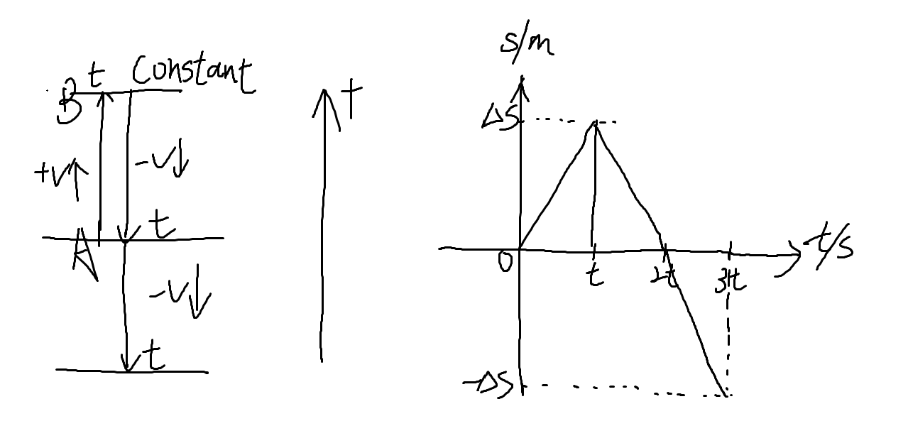
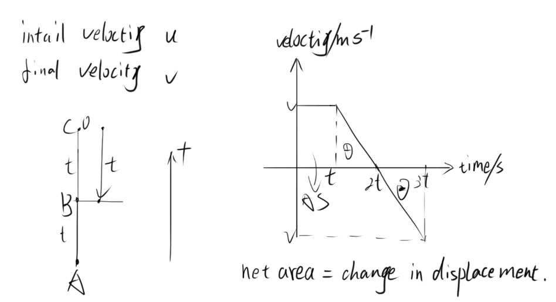
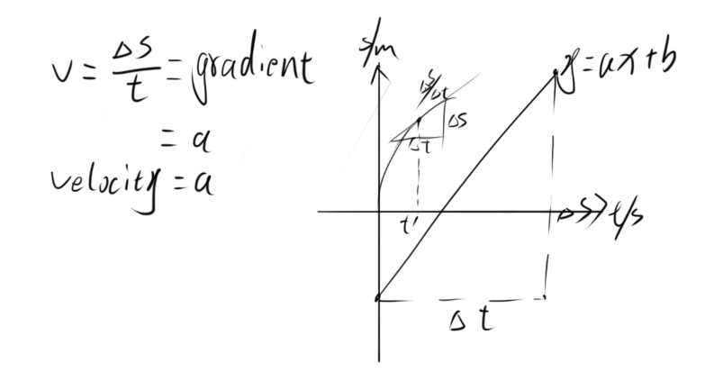
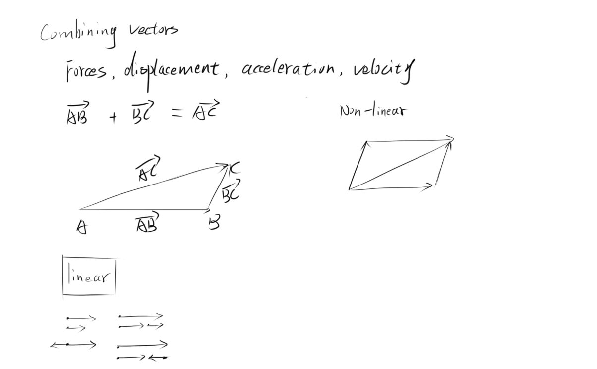
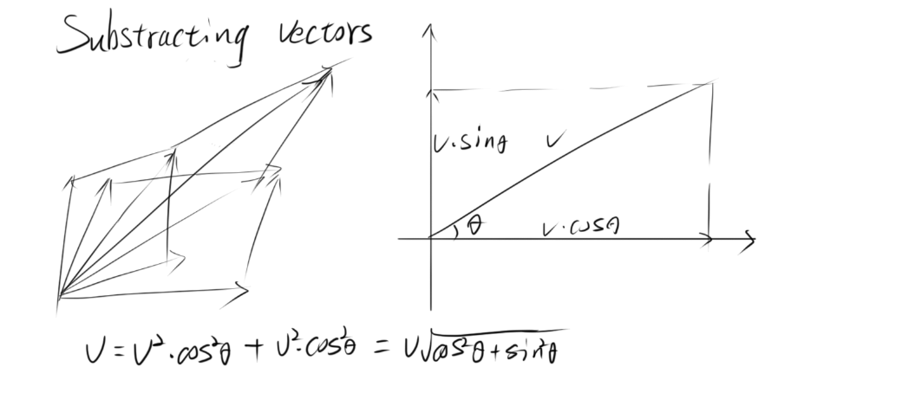

# Part 1 Kinematics

## 1-1 SI units

| Basic quantity     | Unit name | Unit symbol |
|:------------------ | --------- |:----------- |
| mass               | kilogram  | kg          |
| time               | second    | s           |
| length             | metre     | m           |
| electric current   | ampere    | A           |
| temperature        | Kelvin    | K           |
| amount of subtance | mole      | mol         |
| light intensity    | candela   | cd          |

| Derived quantity | Unit name | Unit symbol | Base units equivalent                       |
| ---------------- | --------- | ----------- | ------------------------------------------- |
| force            | nowton    | N           | $kg \cdot m \cdot s^{-2}$                   |
| energy(work)     | joule     | J           | $kg \cdot m^{2} \cdot s^{-2}$               |
| power            | watt      | W           | $kg \cdot m^{2} \cdot s^{-3}$               |
| frequency        | hertz     | Hz          | $s^{-1}$                                    |
| charge           | coulomb   | C           | $A \cdot s$                                 |
| voltage          | volt      | V           | $1kg \cdot m^{2} \cdot s^{-3} \cdot A^{-1}$ |
| resistance       | ohm       | $\Omega$    | $kg \cdot m^{2} \cdot s^{-3} \cdot A^{-2}$  |

**Force:**

$$
\begin{aligned} 
F &= m \cdot a \\
1N &= 1kg \cdot ms^{-2}
\end{aligned}
$$

**Energy：**

$$
\begin{equation} 
\begin{aligned} 
  w &= F \cdot l \\ \nonumber
 1J &= 1N \cdot m \\
&= kg \cdot m^{2}s^{-2}
\end{aligned}
\end{equation}
$$

**Power：**

$$
\begin{aligned}
P &= \frac{E}{t} = \frac{J}{s}\\
1W &= 1kg \cdot m^{2} \cdot s^{-3}
\end{aligned}
$$

**frequency:**

$$
f = 1s^{-1}
$$

**charge:**

$$
\begin{aligned}
Q &= I \cdot t \\
C &= A \cdot s
\end{aligned}
$$

**voltage:**

$$
\begin{aligned}
U &= \frac{P}{I} = \frac{kg \cdot m^{2}s^{-3}}{A} \\
1V &= 1kg \cdot m^{2} \cdot s^{-3} \cdot A^{-1}
\end{aligned}
$$

**resistance:**

$$
\begin{aligned}
R &= \frac{U}{I}\\
1\Omega &= \frac{kg \cdot m^{2} \cdot s^{-3} \cdot A^{-1}}{A}
\end{aligned}
$$

| factor    | Name   | Symbol | factor     | Name   | Symbol |
| --------- | ------ | ------ | ---------- | ------ | ------ |
| $10^1$    | deca-  | da     | $10^{-1}$  | deci-  | d      |
| $10^2$    | hecto- | h      | $10^{-2}$  | centi- | c      |
| $10^3$    | kilo-  | k      | $10^{-3}$  | milli- | m      |
| $10^6$    | mega-  | M      | $10^{-6}$  | micro- | u      |
| $10^9$    | giga-  | G      | $10^{-9}$  | nano-  | n      |
| $10^{12}$ | tera-  | T      | $10^{-12}$ | pico-  | p      |

## 1-2 speed and velocity, distance and displacement

**Distance**: This refers to the total length of the path traveled by an object, regardless of the direction. It is a scalar quantity, which means it only has magnitude and no direction.

**Displacement**: This is the shortest straight-line distance from the initial position to the final position of an object, along with the direction of that line. Displacement is a vector quantity, meaning it has both magnitude and direction.

**Speed**: This is a scalar quantity that refers to the distance traveled by an object per unit of time. It only considers how fast an object is moving, without regard to the direction of motion. $speed = distance / time$

**Velocity**: This is a vector quantity that includes both the magnitude(speed) and the direction of motion.  $velocity = \frac{charge\:in\:displacement}{time\:taken}$

## 1-3 Graphical Works

Displacement - time graphs

Velocity - time Graphs

Deducing velocity from displacement - time graphs

## 1-4 Combining and substracting vectors

