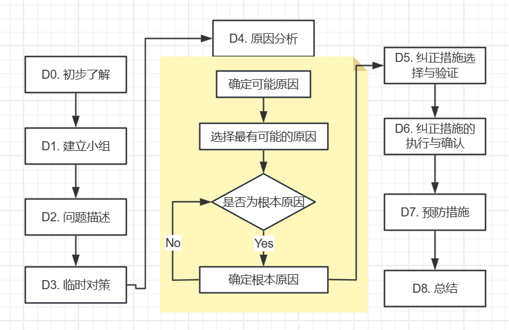

# 1. 什么是 8D ？

8D 又叫 eight disciplines ，团队导向问题解决方法。是由福特公司始创，全球化品质管制及改善的特殊必备方法，之后成为 QS9000/ISO TS16949 福特公司的特殊要求。很多企业使用这个方法解决品质问题，称为一个固定而有共识的标准化问题解决步骤。

8D 精神：
> 1. 面对问题不可各自为政，否则无法有效解决问题。面对问题应该群策群力，相互帮助。

# 2. 为什么要推行 8D ?
> 1. 通过建立小组训练内部合作技巧。
> 2. 提供问题有效的解决方法。
> 3. 防止相同或类似问题再发生。
> 4. 提高客户满意度，增强其对供方的产品和过程的信心。

# 3. 何时使用 8D？
> 1. 重复发生一直没有解决的问题。
> 2. 比较重大的制成品质问题。
> 3. 客户要求的品质投诉。

# 8D 步骤

D0 了解问题的难度，它所带来的损失，潜在的风险以及问题的背景。我们大致从以下几个指标判断。
> 1. 客户的等级。
> 2. 不良率过高
> 3. 会带来巨额损失

## D1 原因涉及到谁，就需要让谁小组加入小组。

D2 描述问题，通常用 5W1H
> 1. What（什么）：指要解决的问题或要讨论的主题是什么。比如，客户为什么要投诉我。
> 2. Why（为什么）：指为什么这个问题重要，或者为什么需要采取某种行动。
> 3. Who（谁）：指与问题相关的人员或利益相关者，包括谁会受到影响或谁负责。
> 4. When（何时）：指事件发生的时间或计划的时间框架。
> 5. Where（哪里）：指事件发生的地点或相关的环境。
> 6. How（如何）：指解决问题的方法或步骤。

D3 防止事情继续恶化（止血），锁定损失。
> 问题追溯：客户端 --> 我们的物流 --> 我们的厂库 --> 我们的产线 --> 原材料厂库 --> 供应商
>
> 一旦发现问题，冻结。未发货批次停止发货。已发货批次，排查风险批次，通知客户这些批次不可使用。已使用的需要马上隔离和标识。

D4 分析工具：鱼骨图（因果图）、5 Whys（五个为什么）、Pareto 分析、流程图、数据收集和分析工具、故障模式与影响分析（FMEA）等。

D5 这一阶段的主要目标是确定有效的解决方案，并确保这些解决方案能够有效地解决问题。

> 1. **选择解决方案：**
>根据在D4阶段（根本原因分析）识别的根本原因，团队需要选择最合适的解决方案。这些解决方案应基于可行性、成本、时间和资源等因素进行评估。
> 2. **验证解决方案的有效性：**
在实施解决方案之前，团队需要验证所选解决方案的有效性。这可以通过小规模试点、模拟或其他验证方法来完成，以确保解决方案能够有效解决问题。
> 3. **制定实施计划：**
> 一旦验证了解决方案的有效性，团队需要制定详细的实施计划，包括时间表、责任分配和所需资源。
> 4. **准备实施：**
确保所有相关人员了解解决方案和实施计划，并准备好进行实施。

D6 这一阶段的主要目标是将选择的解决方案付诸实践，并确保其有效性。
> 1. **实施解决方案：**
根据在D5阶段制定的计划，团队需要将解决方案实际应用到工作流程或产品中。这可能涉及到流程的调整、培训员工、更新文档等。
> 2. **监控实施效果：**
在解决方案实施后，团队需要监控其效果，以确保解决方案能够有效地解决问题。这可以通过收集数据、观察结果和与相关人员沟通来完成。
> 3. **验证解决方案的有效性：**
确保实施的解决方案确实解决了最初识别的问题，并且没有引入新的问题。可以使用统计分析、反馈调查等方法来验证解决方案的有效性。
> 4. **记录和报告结果：**
记录实施过程中的关键数据和结果，以便后续分析和参考。这些记录可以帮助团队了解解决方案的实际效果，并为未来的改进提供依据。
> 5. **调整和优化：**
如果在验证过程中发现解决方案未能完全解决问题，团队需要进行必要的调整和优化，以确保最终结果符合预期。

D7 这一阶段的主要目标是确保所解决的问题不会再次发生。
> 1. **识别和实施预防措施：**
基于所学到的经验和解决方案的实施结果，团队需要识别出可以防止类似问题再次发生的措施。这可能包括流程改进、标准操作程序（SOP）的更新、培训计划的实施等。
> 2. **更新相关文档：**
确保所有相关的文档、流程图和操作手册都得到更新，以反映新的预防措施和改进。这有助于确保所有团队成员都遵循最新的流程。
> 3. **培训和沟通：**
对相关人员进行培训，确保他们了解新的预防措施和改进的内容。有效的沟通可以帮助团队成员理解为什么这些变化是必要的，以及如何实施。
> 4. **监控和评估：**
在实施预防措施后，团队需要监控其效果，以确保这些措施能够有效防止问题的再发生。这可以通过定期审查、数据分析和反馈收集来完成。
> 5. **记录和分享经验：**
记录在解决问题和实施预防措施过程中获得的经验教训，并与团队和组织内的其他成员分享。这有助于提高整体的质量管理水平，并为未来的改进提供参考。