# 3. 程序的机器级表示

## 3.4 jump & blab

### jump Instections

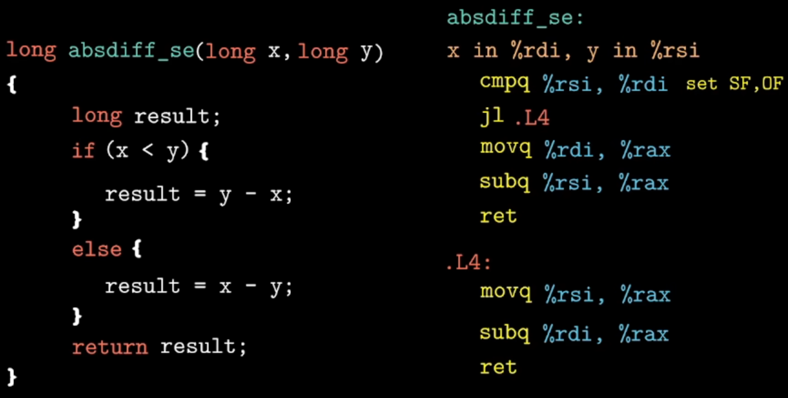

> `cmpq` 进行的操作：`%rdi - %rsi`, 根据结果设置 SF、OF
> 
> `jl` (l is short for less)：如果这条指令执行，就跳转到 `.L4`处。是否跳转由 `SF^OF` 决定。

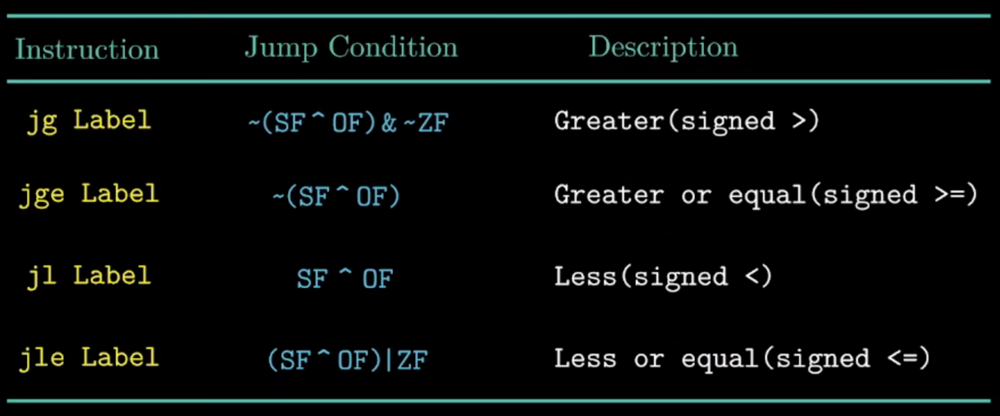

`jump` 无条件跳转，遇见指令，就跳转。

### Conditional Control

下面两段代码实现了相同的效果：

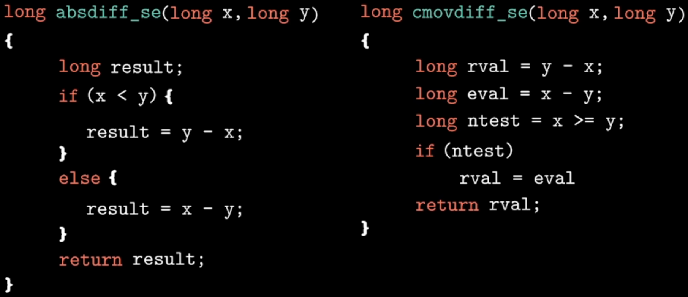

上图右边生成的汇编如下：

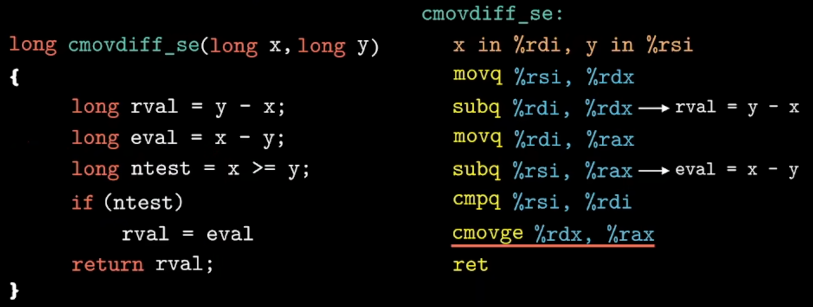

`cmovge` ：c 表示 condition ; ge：表示 greater equal

```asm6502
cmpq %rsi %rdi       --> x - y
cmovge %rdx %rax     --> ~(SF^OF)
```

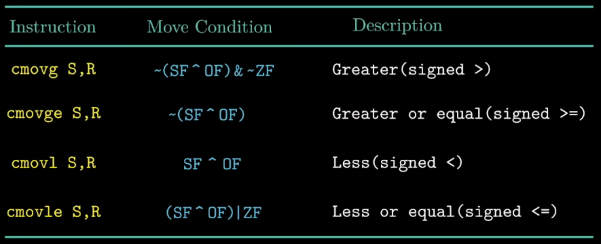

### Loops

```c++
do
//    body-statement
while(test-expr);


while(test-expr)
//    body-statment


for(init-expr; test-expr; update-expr)
//    body-statment
```

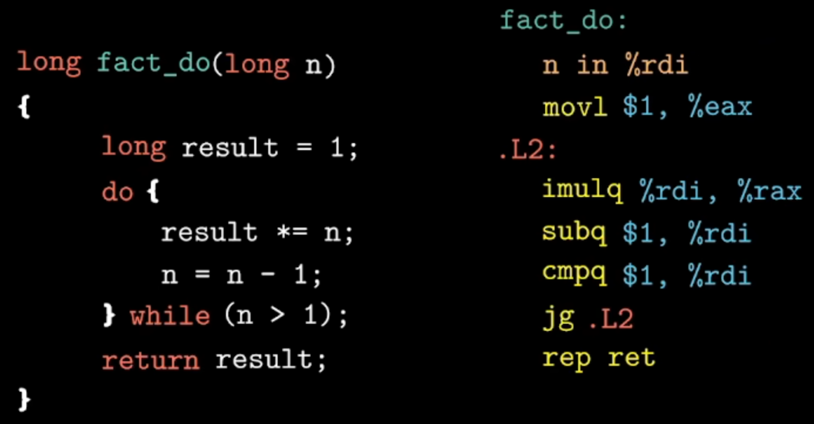

```c++
void switch_log(long x, long n, long *dest)
{
    long val = x;
    switch(n){
    case 0:
        val *= 13;
        break;
    case 2:
        val += 10;
    case 3:
        val += 11;
    case 4:
    case 6:
        val += 11;
        break;
    default:
        val = 0;
    }
    *dest = val;
}
```

```asm6502
switch_eg:
    n in %rsi
    cmpq $6, %rsi
    ja .L8
    leaq .L4(%rip), %rcx
    movslq (%rcx, %rsi, 4), %rax
    addq %rcx, %rax
    jmp *%rax
```

对于`switch` 生成的代码，都会维护一张跳转表，这个跳转表帮助我们跳转到对应的代码段。不论多少级，他都是执行一次跳转。如果用 if……else 就会涉及多次的判断和跳转。

## 3.5 Procedures(过程)

函数 P 在调用 Q 的过程中，在程序内部、竞争的空间里、在内存里面都发生了什么?

```c++
long P(){
    // ...
}
long Q(){
    // ...
}
```

* Passing control (传递控制)

* Passing data (传递数据)

* Allocating and deallocating memory (分配和释放内存)

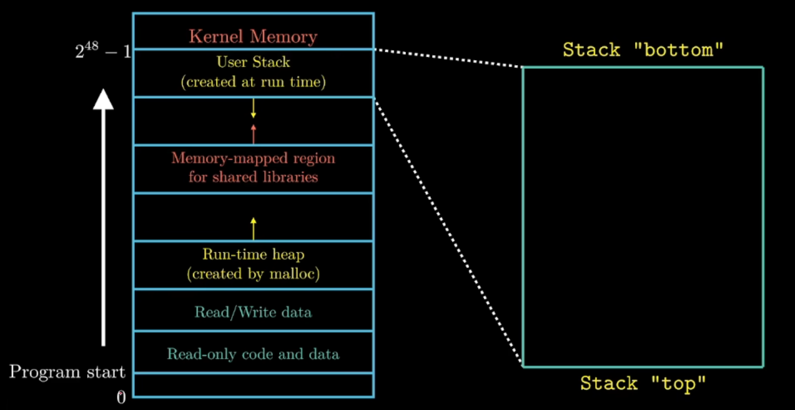

上图表示的是一个进程在内存中的抽象。对于当前执行的程序来说，它似乎是独占了整个内存空间。

### stack frame(栈帧)

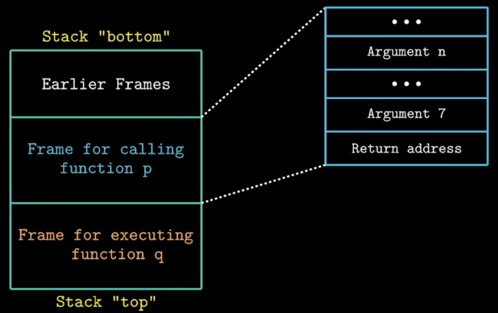

一个栈帧对应一个函数。函数调用有6个寄存器可以保存参数，多余的部分放到 stack 中（stack的本质就是具有特殊地址范围的内存）。

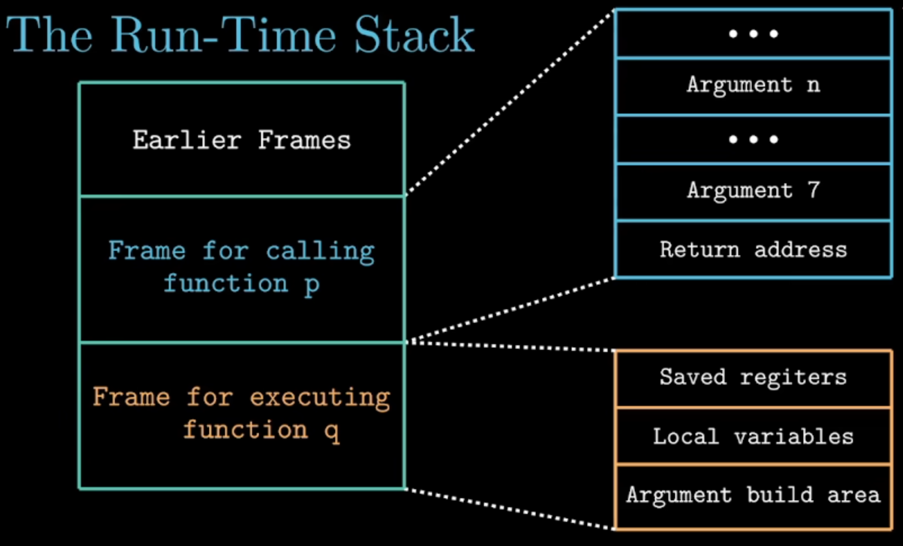

对于 q 这个 stack frame，如果说我们需要用到一些寄存器，但是这些寄存器我们已经在 p 中用过了，  我们就需要将原来的值先保存一下，不然在恢复 p 时，寄存器的内容就被覆盖了。

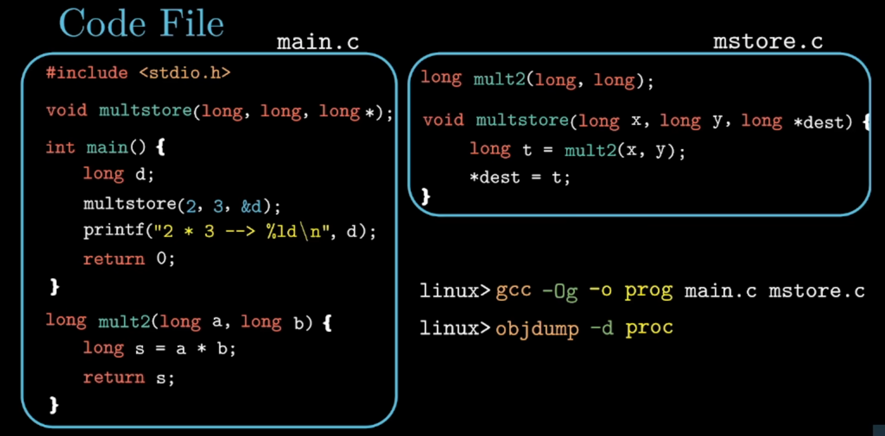

反汇编代码：

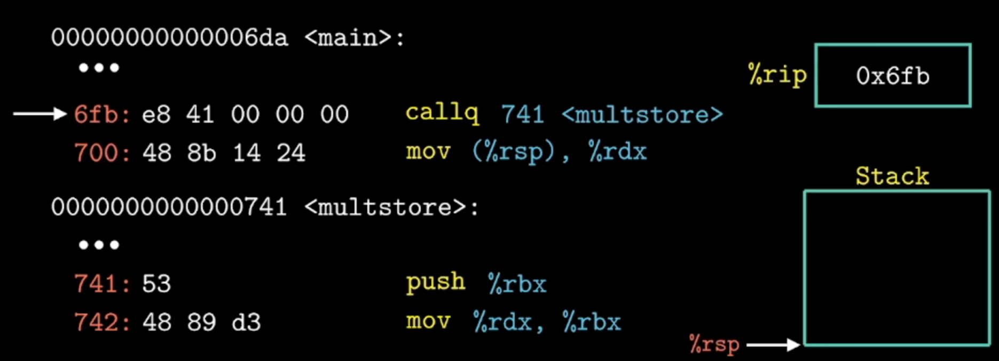

当程序执行到地址`6fb`时，非通用寄存器`%rip`会记录cpu当前执行指令的地址。当执行`callq`指令会跳转到`741`处，这时`callq`指令会做两个事情：首先，会去更新`%rip`地址为`741`，其次保存返回地址(return address)`700`到栈中。当multstore 执行完后，需要恢复`%rip`。

### data transfer

参数对应到的寄存器。

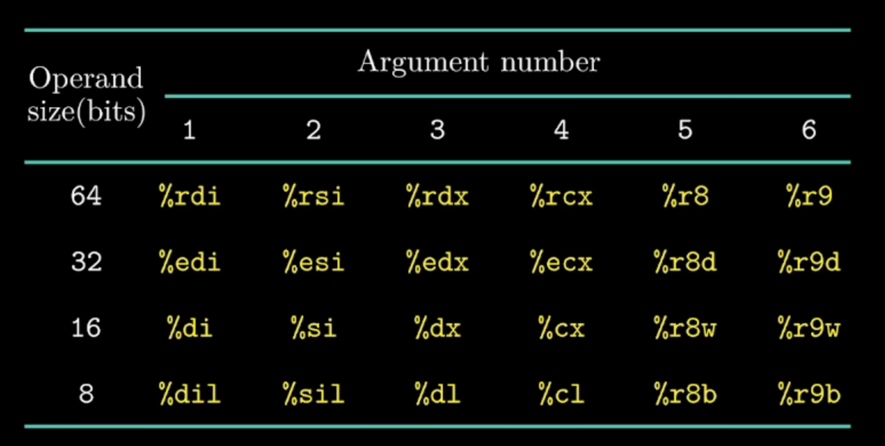

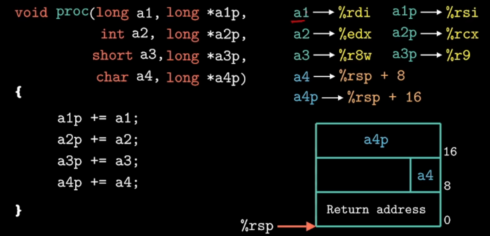

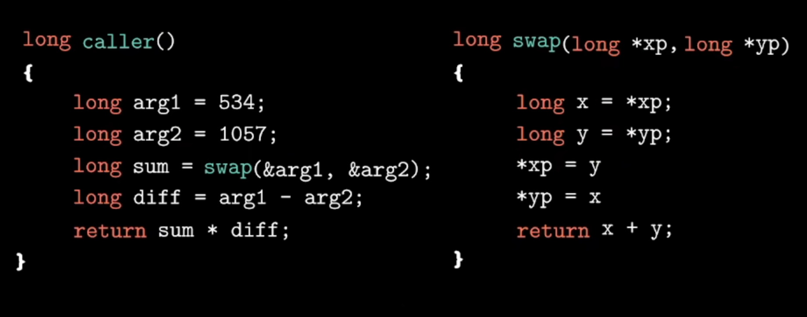

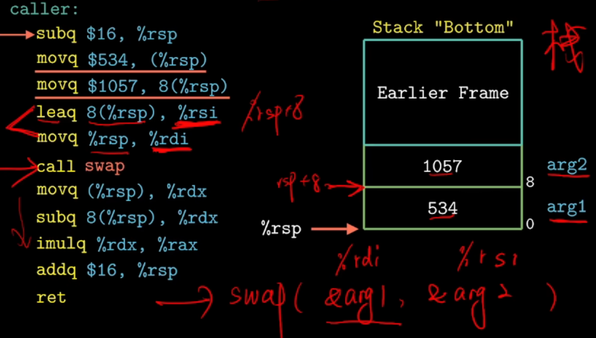

超过6位传参的例子：

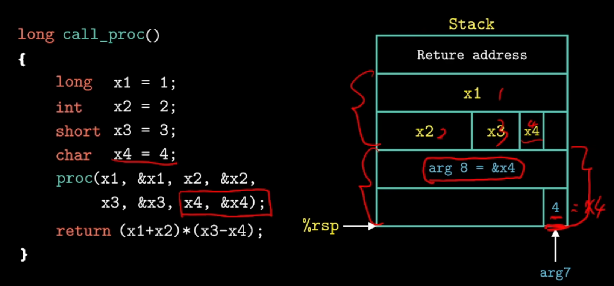

### local storage in register

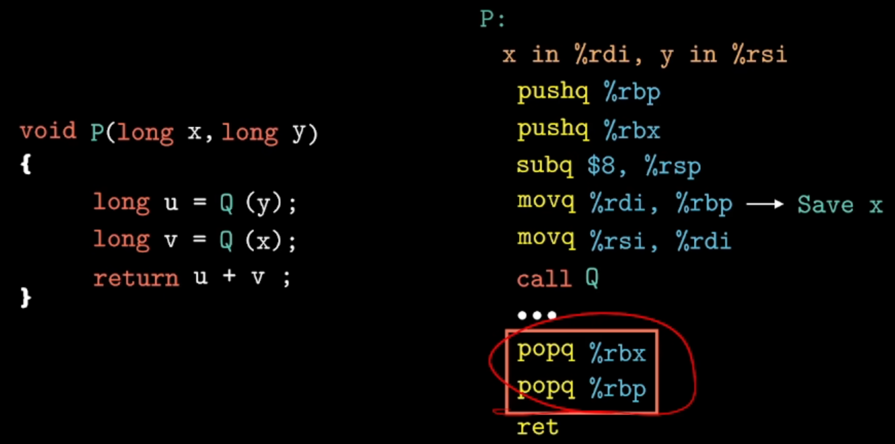

### Recursive Procedures

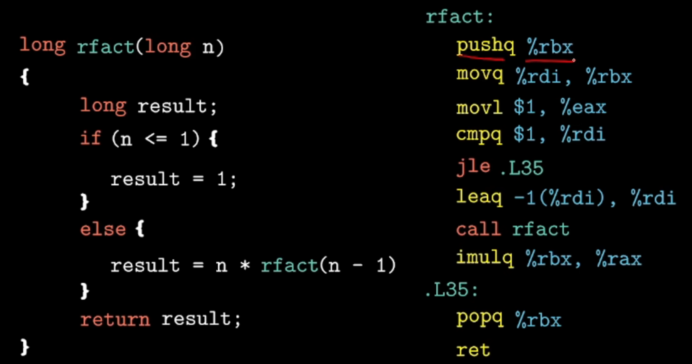

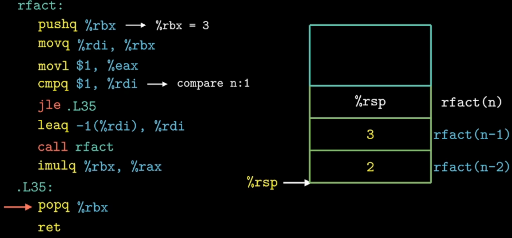

## 3.6 nested arrays

二维数组底层依旧是以线性的方式存储：

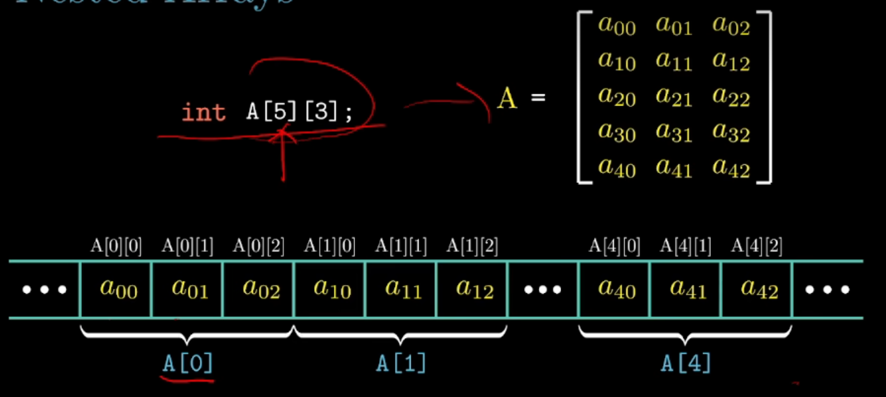

二维数组地址的计算方式：

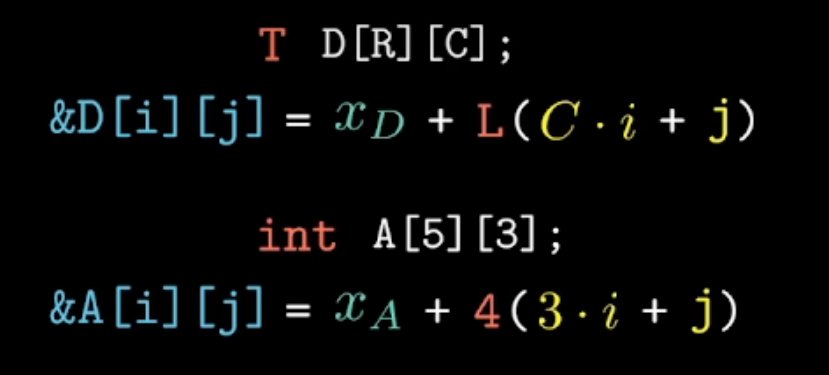


