# 1. 算法复杂度

程序 = 数据结构 + 算法 —— Niklaus Wirth(瑞士，1984年图灵奖获得者)

数据结构是一种存储和组织数据的方式，指在便于访问和修改。

**算法是一组完成特定任务的有穷指令序列**

所有的算法必须满足以下标准：

* 输入：有 0 个或多个由外部提供的输入量。

* 输出：至少产生一个输出量

* 确定性：每条指令都有明确的语义，无歧义

* 有限性：算法的任何一条指令都能在有限步之内结束

* 有效性：每一条指令都必须足够简单，原则上，只用纸和笔就可以处理这一条指令，仅仅满足条件3中的要求还是不够，指令必须是可行的。

## 1.1 算法的效率

**度量算法的指标**

* 时间复杂度

时间复杂度也成为渐进时间复杂度，T(n) = O(f(n))

随着问题规模 n 的增大，算法执行时间的增长率和f(n)增长率成正比。

**程序运行的总时间主要和两点相关：**

执行每条语句的耗时

每条语句的执行频率

* 空间复杂度

描述某个算法对应的程序想要在计算机上执行，除了需要内存空间来存储程序代码和输入数据之外，<font color='blue'>还行要的额外空间</font>。

**插入排序**

INSERTION-SORT，数组A[1..n]，包含长度为 n 的要排序的序列该算法在数组 A 中重排这些数，任何时候，最多只有其中常数个数，存储在数组外面，排序后，得到数组 A 中是已拍好序的。

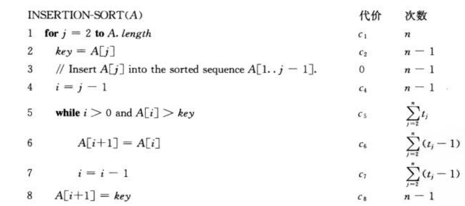

第一行：虽然我们是从 2 执行的，但是在第 n + 1 条时，虽然不进入循环，但是也已经比对过了。所以是 n 次执行。

算法的最好情况就是，每次都不满足 5 行的执行条件，所以 6、7行不执行，5、8执行 n - 1 次。因此我们可以得到在<font color='blue'>最好情况下的复杂度：给出的数组已经是排好序的。</font>

$$
\begin{equation} 
\begin{aligned} 
  T(n) &= c_1n + c_2(n - 1) + c_4(n - 1) + c_5(n-1) + c_8(n-1)\\
       &= (c_1 + c_2 + c_4 + c_5 + c_8)n - (c_2 + c_4 + c_5 + c_8) \nonumber
\end{aligned}
\end{equation}
$$

<font color='red'>我们可以把运行时间表示为: $an + b$ </font>

<font color = 'red'> 其中 a 和 b 依赖于代价 $c_i$ ，因此运行时间是 n 的线性函数。</font>

$$
T(n) = O(n)
$$

然而大部分情况下都是不好的，<font color='blue'>最坏的情况下：</font>

如果输入数组是从大到小的排序，则会导致最坏情况。我们必须将每个元素 A[j] 与整个拍好序的子数组 A[1...j-1]中每个元素进行比较。所以 j = 2时，比较 2 次，j = 3 时， 比较3 次 ... j = n 时，比较 n 次，所以对所有 $j = 2, 3, ... , n$ ，有 $t_j = j$ 。注意到：

$$
\sum_{j = 2}^{n}j = \frac{n(n+1)}{2} - 1
$$

6、7 每次都比 5 少执行一次：

$$
\sum_{j = 2}^{n} (j - 1) = \frac{n(n-1)}{2}
$$

$$
\begin{equation} 
\begin{aligned} 
 T(n) &= c_1n + c_2(n - 1) + c_4(n - 1) + c_5(\frac{n(n - 1}{2} - 1) + c_6(\frac{n(n - 1)}{2}) + c_7(\frac{n(n - 1)}{2}) + c_8(n - 1)\\
      &= \frac{c_5 + c_6 + c_7}{2}n^2 + (c_1 + c_2 + c_4 + \frac{c_5 - c_6 - c_7}{2} + c_8)n + c_2 + c_4 + c_5 + c_8
\end{aligned}
\end{equation}
$$

我们可以简化式子 $an^2 + bn + c$

其中a、b、c 依赖于语句代价 $c_i$ , 因此运行时间是 n 的二次函数。

$$
T(n) = O(n^2)
$$

通常情况下，我们只求最坏情况的运行时间。它给出了一个运行时间的上界。对于某些算法，最坏情况是通常出现的，”平均情况“往往与最坏情况一样差。

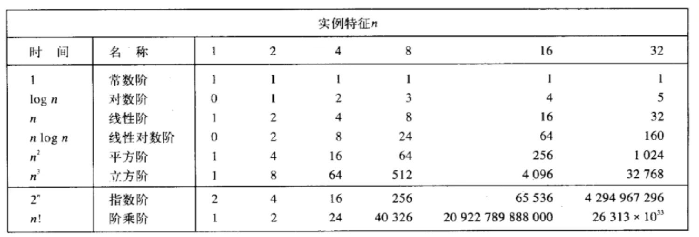

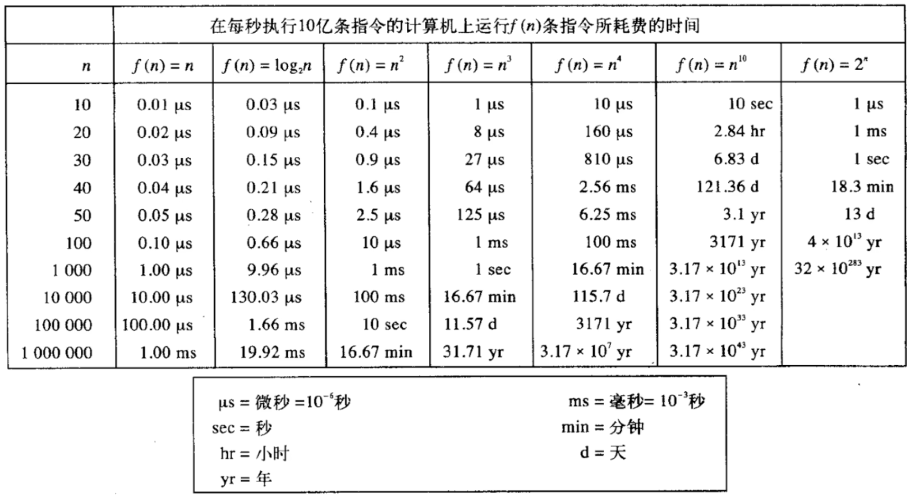

# 2. 顺序表

用一组连续的内存单元依次存储线性表的各个元素，也就是说，逻辑上相邻的元素实际上物理存储空间也连续。

```c
#define MAXSIZE 100
typedef int ElemType;

typedef struct{
    ElemType data[MAXSIZE];
    int length;
}SeqList;
```

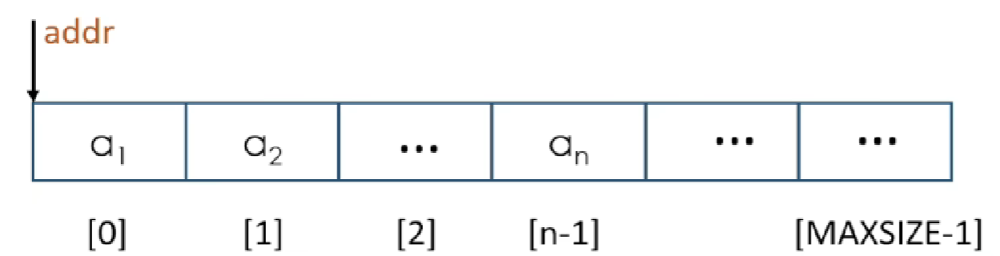

## 2.1 初始化数组

```c
void init_list(SeqList* l){
    l->length = 0;
}
```

## 2.2 尾部添加元素

```c
void append_elem(SeqList *l, ElemType e){
    if(l->length >= MAXSIZE){
        //output error
    }
    l->data[l->length] = e;
    l->lenght++;
}
```

## 2.3 遍历元素

```c
void list_elem(SeqList *l){
    for(int i=0; i<l->length; i++){
        printf("%d%, l->data[i]);
    }
    printf("/n");
}
```

## 2.4 插入元素

最差情况的时间复杂度 O(n)

```c
void insert_elem(SeqList *l, int pos, ElemType e){
    if(l->length + 1 >= MAXSIZE){
        // error
    }
    if(pos < 1 || pos > l->length){
        // error
    }

    if(pos <= l->length){
        for(int i = l->length - 1; i >= pos - 1; i--){
            l->data[i + 1] = l->data[i];
        }
        l->data[pos-1] = e;
        l->length++;
    }
}
```

## 2.5 删除元素

```c
void delete_elem(SeqList *l, int pos, ElemType* e){
    *e = l->data[pos - 1];
    if(pos < l->length && pos > 0){
        for(int i = pos; i < l->length; i++){
            l->data[i-1] = l->data[i];
        }
        l->length--;
    }
}
```

## 2.6 查找元素

```c
int find_elem(SeqList *l, ElemType e){
    if(l->length == 0){
        // empty
    }

    for(int i = 0; i < l->length; i++){
        if(l->data[i] == e){
            return i + 1;
        }
    }
    return 0;
}
```

# 3. 链表

```c
typedef int ElemType;

typedef struct node{
    ElemType data;
    struct node* next;
}Node;
```

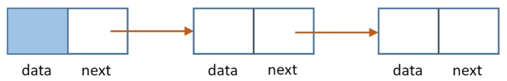

### 3.1 初始化链表

```c
Node* init_list(){
    Node* head = (Node*)malloc(sizeof(Node));
    head->data = 0;
    head->next = NULL;
    return head;
}
```

### 3.2 头插法

```c
void insert_head(Node* l, ElemType e){
    Node* n = (Node*)malloc(sizeof(Node));
    n->data = e;
    n->next = l->next;
    l->next = n;
}
```

### 3.3 遍历元素

```c
void list_node(Node* l){
    Node* p = l->next;
    while(p != NULL){
        printf("%d\t", p->data);
        p = p->next;
    }
    printf("\n");
}
```

### 3.4 尾插法

```c
void insert_tail(Node* l, ElemType e){
    Node* p = l->next;
    while(p->next != NULL){
        p = p->next;
    }
    p->next = (Node*)malloc(sizeof(Node));
    p->next->data = e;
    p->next->next = NULL;
}
```

### 3.5 任意位置插入节点

```c
void insert_node(Node* l, int pos, ElemType e){
    Node *p = l;
    int i = 0;
    while(i < pos - 1){
        p = p->next;
        i++;
        if(p == NULL){
            // exception
        }
    }
    Node* q = (Node*)malloc(sizeof(Node));
    q->data = e;
    q->next = p->next;
    p->next = q;
}
```

### 3.6 删除节点

```c
void delete_node(Node* l, int pos){
    Node *p = l;
    int i = 0;
    while(i < pos - 1){
        p = p->next;
        i++;
        if(p==NULL)
            // error
    }
    if(p->next == NULL){
        // error
    }
    Node* q = p->next;
    p->next = q->next;
    free(q);
}
```

### 3.7 释放链表

```c
void free_list(Node* l){
    Node* p = l->next;
    Node* p;
    while(p != NULL){
        q = p->next;
        free(p);
        p = q;
    }
    l->next = NULL;
}
```

# 4. 循环链表&双链表

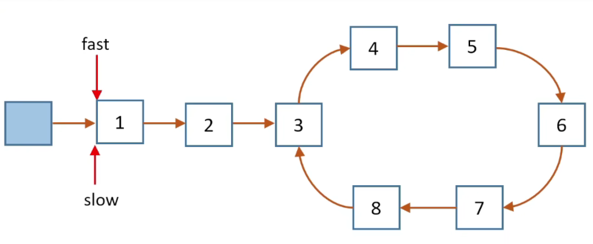

判断链表是否有环，fast 每次走两步，slow 每次走一步，相遇即有环。

```c
bool hasCycle(struct ListNode *head){
    struct ListNode *fast = head;
    struct ListNode *slow = head;

    while(fast != NULL && fast->next != NULL){
        fast = fast->next->next;
        slow = slow->next;

        if(fast == slow){
            return true;
        }
    }
    return false;
}
```

确定入口节点：

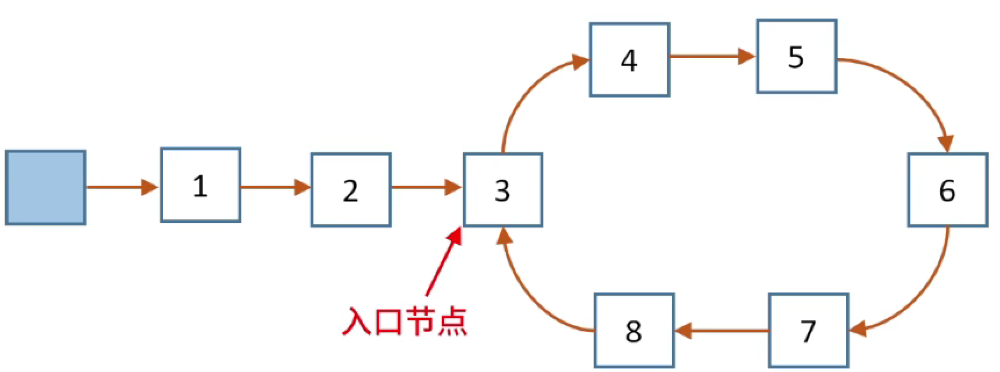

我们会发现，fast 和 slow 相遇时，fast 比 slow 多走了 n 步。这个 n 步恰好是环的数量。我们再让 fast  和 slow 回到头节点，让 fast 先行 n 步，然后再让 fast 和 slow 同时走，相遇的节点即为入口节点。

```C
while(fast != NULL && fast->next != NULL){
    fast = fast->next->next;
    slow = slow->next;
    if(fast = slow){
        struct ListNode* p = fast;
        int count = 1;
        while(p->next != slow){
            count++;
            p = p->next;
        }
        
        fast = head;
        slow = head;
        for(int i = 0; i < count; i++){
            fast = fast->next;
        }
        while(fast != slow){
            fast = fast->next;
            slow = slow->next;
        }
        return slow;
    }
}
```

## 4.1 排序循环链表

```c
struct Node* insert(struct Node* head, int insertval){
    struct Node* node = (struct Node*)malloc(sizeof(struct Node));
    node->val = insertval;
    if(head == NULL){            // 循环链表误解点
        head = node;
        head->next = head;
    }
    else if(head->next == head){    // 只有头节点
        head->next = node;
        head->next = head;
    }
}
```

寻找最大值指针：

```C
struct Node* first = head;
struct Node* second = head->next;
struct Node* biggest = head;


while(!(first->val <= node->val && second->val >= node->val) && second != head){
    first = second;
    second = second->next;
    if(first->val >= biggest){
        biggest = first;
    }
}


if(first->val <= node->val && second->val >= node->val){
    first->next = node;
    node->next = second;
}else{
    node->next = biggest->next;
    biggest->next = node;
}
```

## 4.2 双向链表

```c
typedef int ElemType;


typedef struct Node{
    ElemType data;
    struct Node *prev, *next;
}Node;
```

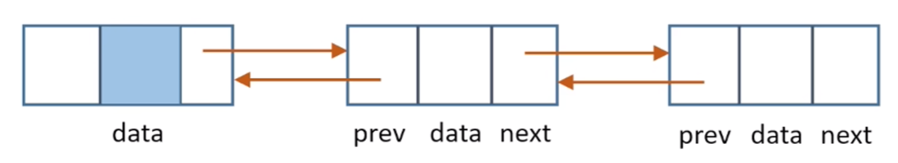

# 5. 栈

栈是一种特殊的线性表，其插入和删除操作都在一端进行，插入和删除端称为栈顶，另一端成为栈底。

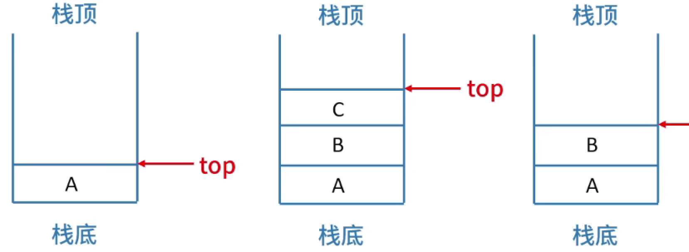

**栈的基本操作**

* init_stack() 

* is_empty()

* push()

* pop()

* get_top()

# 6. 树

**树的定义：**

树是一个或多个节点的集合。

* 存在一个称为根的特定节点。

* 其余节点被分为 n 个互不相交的集合 $T_1$，$T_2$, ... , $T_n$, 其中的每个集合都是一颗树。$T_1$, $T_2$, ... $T_n$，称为根节点的子树。

* 一个节点的度：该节点的子树的个数。

* 树的度：树中所有节点的度的最大值。

* 度为0的节点称为叶子节点或终端节点。

<font color = 'blue'>性质1：</font>树中所有节点数等于所有节点的度数之和加1。

<font color='blue'>性质2：</font>对于度为 m 的树，第 i 层上最多有 $m^{i-1}$个节点。

<font color='blue'>性质3：</font>对于高度为 h，度为 m 的树，最多总共有$\frac{m^h - 1}{m-1}$ 。<font color='blue'>等比数列求和公式:</font> $S_n = \frac{a_1(1 - q^n)}{1 - q}$

<font color='blue'>性质4：</font>具有 n 个节点的 m 叉树的最小高度为$[\log_{m}{n(m - 1)+1}]$

## 6.1 二叉树的定义和特点

定义：二叉树是有限多个节点的集合，这个集合可以是空集，也可以是一个由根节点和两棵互不相交的、分别称之为左子树和右子树的二叉树组。

* 每个节点最多有两颗子树

* 左子树和右子树是有顺序的，次序不能颠倒。

* 如果二叉树中的某个节点只有一颗子树，也是要区分左右子树。

* 二叉树中的某个节点只有一颗子树，也要区分左右节点。

## 6.2 二叉树的性质

<font color = 'blue'>性质1：</font>二叉树的第 i 层最多有 $2^{i - 1}$个节点。

<font color='blue'>性质2：</font>深度为 h 的二叉树最多有 $2^h - 1$ 个节点。

<font color='blue'>性质3：</font>对于任意非空的二叉树 T ，如果节点的个数为 $n_0$, 而度为2节点的个数为$n_2$, 则$n_0 = n_2 + 1$。

**假设二叉树 T 的节点数为 n，度为 1 的节点数为$n_1$** 则，$n = n_2 + n_1 + n_0$

**根据二叉树中的连接线(边)进行计数，每根连接线都有一个出发节点和一个到达节点。除了根节点之外，其余每一个节点都有与连接线的到达节点一一对应。假设二叉树中的连接线的数量为B，则：$n = B + 1$**

**所有的连接线都是从度为1和度为2的节点出发的，度为1的节点对应一根连接线，度为2的节点对应两个连接线。$B = n_1 + 2n_2$**

**根据刚刚得到的：$n = B + 1$**

$$
n = n_1 + 2n_2 + 1
$$

$$
n = n_0 + n_1 + n_2
$$

所以证明：$n_0 = n_2 + 1$

### 6.2.1 满&完全二叉树

一个深度为 n，并且具有 $2^n - 1$ 个节点的二叉树。

* 所有的叶子节点在最后一层。

* 非叶子节点度为2

* 同样深度的二叉树，满二叉数的节点最多，叶子节点也最多。

如果对于完全二叉树进行编号，根节点从 1 开始，从上到下，从左到右

* 对于编号为 i 的节点(非根节点)，节点 i 的父节点的编号为 [i/2]

* 当 i 为偶数时，它是左子节点，父节点为 i/2

* 当 i 为奇数时，它是右子节点，父节点为 (i-1)/2

## 6.3 二叉树的存储

顺序存储：可以申请一个连续的数组，每个索引保存一个节点

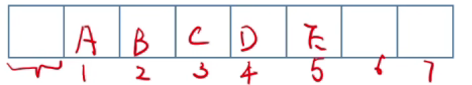

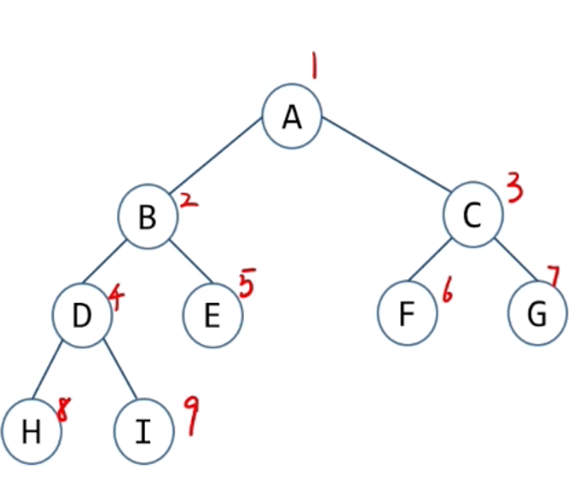

数组只合适满二叉树或完全二叉树。二叉树的

如果说，二叉树的形状，节点的丰富程度与完全二叉树差异比较大，有大量的元素是不存在的，这个时候我们还用顺序存储，这样势必会浪费掉很多空间。为了节约空间，还是需要引入链式存储。

```c
typedef char ElemType;


typedef struct TreeNode{
    ElemType data;
    struct TreeNode* left_child;
    struct TreeNode* right_child;
}TreeNode;

typedef TreeNode* BiTree;
```

## 6.4 二叉树的遍历

### 6.4.1 前序遍历

在这种遍历中，先访问节点，然后访问左分支上遇到的每一个节点，继续这一过程，直到遇到空节点为止。这时，返回到最近的有右子节点的父节点，并从该节点的右子节点开始继续遍历。

```c
void pre_order(BiTree T){
    if(T == NULL){
        return;
    }
    printf("%c", T->data);
    pre_order(T->left_child);
    pre_order(T->right_child);
}
```

非递归遍历：

```c
void iter_preorder(BiTree T){
    while(T != NULL || is_empty() != 0){
        while(T != NULL){
            printf("%c", T->data);
            push(&top, T);
            T = T->left_child;
        }
        T = pop(&top);
        T = T->right_child;
    }
}
```

### 6.4.2 中序遍历

中序遍历就是从二叉树的根节点开始，向树的左下方移动，知道遇到空节点为止，然后访问空姐点的父节点。接着据徐遍历该节点的右子树，如果右子树没有子树可以遍历，那么继续遍历上一层最后一个被访问的节点。

```C
void in_order(BiTree T){
    if(T == NULL){
        return;
    }
    in_order(T->left_child);
    printf("%c", T->data);
    in_order(T->right_child);
}
```

非递归遍历: 需要用到非系统栈

```c
void iter_preorder(BiTree T){
    while(T != NULL || is_empty() != 0){
        while(T != NULL){
            push(&top, T);
            T = T->left_child;
        }
        printf("%c", T->data);
        T = pop(&top);
        T = T->right_child;
    }
}
```

### 6.4.3 后序遍历

在这几种遍历中，先访问节点的左右儿子，再对该节点进行访问。这意味着节点的儿子将在该节点之前输出。

```c
void post_order(BiTree T){
    if(T == NULL){
        return;    
    }
    post_order(T->left_child);
    post_order(T->right_child);
    printf("%c", T->data);
}
```

非递归遍历:

```c
void iter_inorder(BiTree T){
    BiTree prev = NULL;

    while(T != NULL || is_empty() != 0){
        while(T != NULL){
            push(&top, T);
            T = T->left_child;
        }
        T = get_top(&top);

        // 判断 T 指向的结点有没有右子树
        // 它的右子树是否有遍历
        if(T->right_child != NULL && T->right_child != prev){
            T = T->right_child;
        }else{
            pop(&top);
            printf("%c", T->data); // 下一个遍历的节点是它的父节点。
            prev = T;
            T = NULL;              // 父节点已经在栈中，所以将 T 设置为 null
        }
    }
}
```

### 6.4.4 创建树

```C
void create_tree(BiTree* T){
    ElemType ch;
    ch = str[index++];
    if(ch == '#'){
        *T = NULL;
    }else{
        *T = (BiTree)malloc(sizeof(TreeNode));
        (*T)->data = ch;
        create_tree(&(*T)->left_child);
        create_tree(&(*T)->right_child);
    }
}
```

### 6.4.5 层序遍历

```c
void level_order(BiTree T){
    if(T == NULL){
        return;
    }
    enqueue(&rear, T);

    while(1){
        BiTree curr = dequeue(&front, rear);
        if(curr != NULL){
            printf("%c", curr->data());
            if(curr->left_child != NULL)
                enqueue(&rear, curr->left_child);
            if(curr->right_child != NULL)
                enqueue(&rear, curr->right_child);
        }
        else
            break;
    }
}
```

## 6.5 线索二叉树
