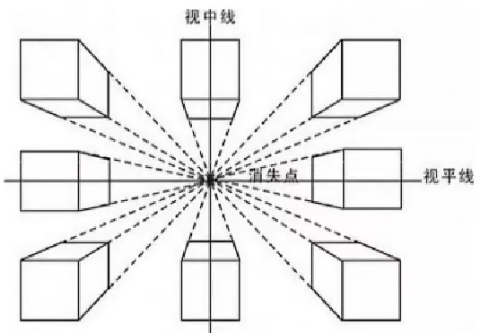
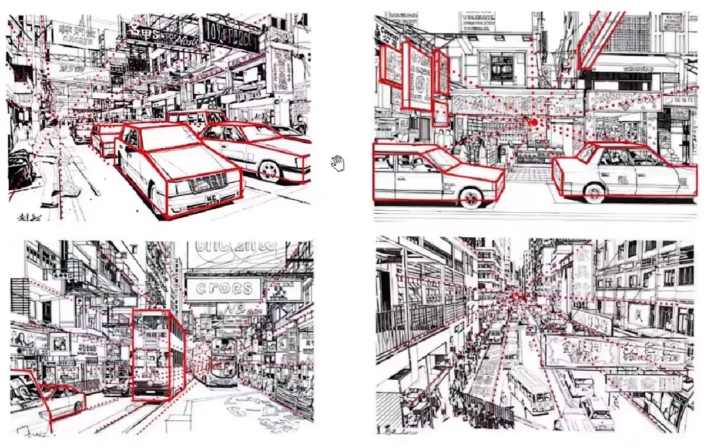

# 透视

## 1、透视的含义

1. 在显示物体的大小与距离有关系，越近越大，越远越小，最总会消失在地平线；

2. 事务的平行线越远越靠拢和聚集，最后会聚为一点而消失在地平线上；

3. 物体的轮廓线条距离人眼越近越清晰，越远则越模糊。

## 2、透视的分类

在现实生活中透视一般分为四类：

1. 散点透视：无数的消失点，而且不在地平线上

2. 一点透视：地平线上有一个消失点

3. 两点透视：地平线上有两个消失点

4. 三点透视：两个点消失于地平线，一个点垂直于地平线

# 一点透视

1. 含义

一点透视也叫平行透视，指的是有一面与画面成平行的正方形或长方形物体的透视。这种透视有整齐、平展、稳定、庄严的感觉。

通过右边的图片你会发现，除了和你平行的面之外，其它的所有的边都消失在地平线上。是相对比较简单自然的透视。

 
 
 
 
 
 
 
 
 
 

2. 一点透视案例

