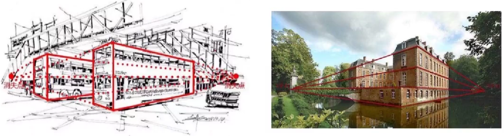

# 透视

## 1、透视的含义

1. 在显示物体的大小与距离有关系，越近越大，越远越小，最总会消失在地平线；

2. 事务的平行线越远越靠拢和聚集，最后会聚为一点而消失在地平线上；

3. 物体的轮廓线条距离人眼越近越清晰，越远则越模糊。

## 2、透视的分类

在现实生活中透视一般分为四类：

1. 散点透视：无数的消失点，而且不在地平线上

2. 一点透视：地平线上有一个消失点

3. 两点透视：地平线上有两个消失点

4. 三点透视：两个点消失于地平线，一个点垂直于地平线

## 一点透视

1. 含义

一点透视也叫平行透视，指的是有一面与画面成平行的正方形或长方形物体的透视。这种透视有整齐、平展、稳定、庄严的感觉。

通过右边的图片你会发现，除了和你平行的面之外，其它的所有的边都消失在地平线上。是相对比较简单自然的透视。

 
 
 
 
 
 
 
 
 
 

2. 一点透视案例

3. 一点透视的画法

地平线上的可以看到底部，经过地平线的方块只有两个面，经过地平线底部的面可以看到顶部。

## 两点透视
1. 两点透视的含义

两点透视也叫成角透视，就是任何一面都不与视线平行的物体透视。这种透视能使构图有变化。

通过右边的图可以发现没有与你平行的面并且有两个消失点，两点透视也是比较常见的透视。

 
 
 
 
 
 
 
 
 

2. 案例

## 三点透视
1. 含义

三点透视也叫倾斜透视，立方体相对于画面，其面及线都不平行，边可以延伸为三个消失点，一般俯视或仰视去看事物就会形成三点透视。

2. 案例

# 人体比例

**头**顶到下颚，表示 1 个头长。

**胸腔**也是一个头长，有时为了与头做出区别，可以适当曾长一丁点。

**盆腔**大概 0.7 个头长。

**大臂**和**小臂**都是一个头长。

**胸腔**的宽度大致与头款一致，可能会长一点点。

**肩宽**大致 1.2 个头长。

**盆腔宽**大致 1.2 个头长

**大腿** & **小腿** 均大致为 1.5 个头长